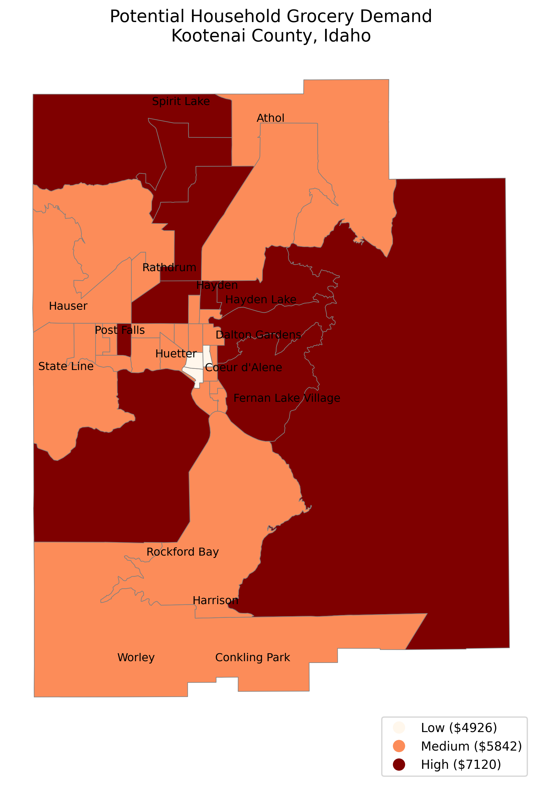
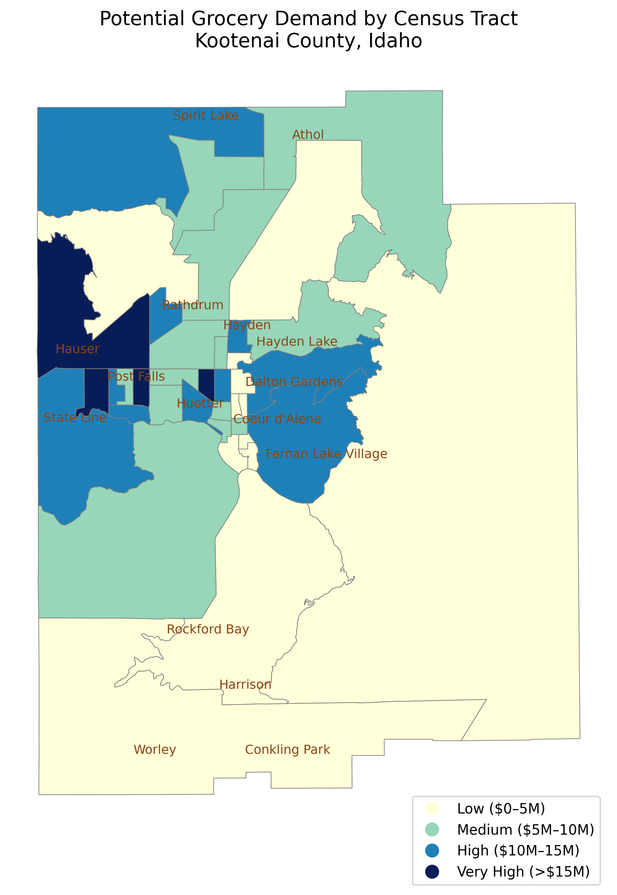
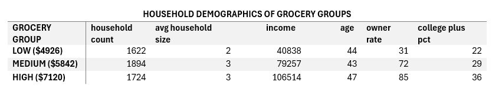
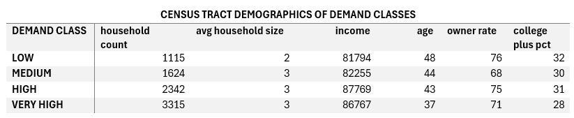
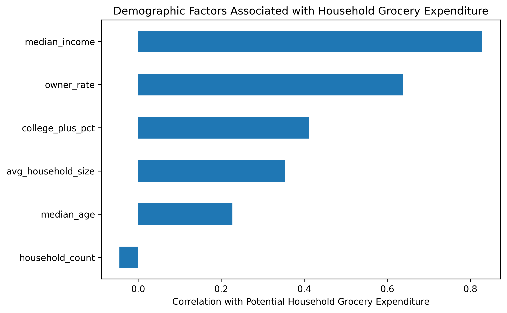
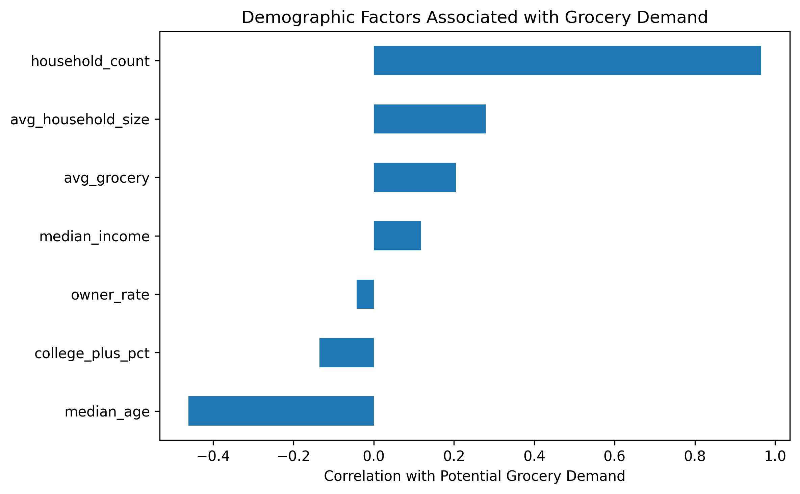

# Grocery Demand Estimation

## Project Overview

This project aims to answer the following key questions about grocery demand across Kootenai County:

- How much potential grocery demand exists across the county on census tract level?
- What are the spatial patterns of grocery demand?
- Which demographic characteristics are associated with areas of higher grocery demand?

By integrating Consumer Expenditure Survey (CE) data with American Community Survey (ACS) demographic data, this project estimates potential household grocery expenditure at the census tract level and explores the demographic factors associated with spatial variations in grocery demand. 

---

## Objectives

- Estimate household grocery spending using BLS Consumer Expenditure Survey data.
- Calculate census tract-level grocery market potential.
- Map the spatial distribution of estimated grocery demand.
- Classify census tracts into grocery demand categories.
- Profile high- and low-demand areas using key demographic characteristics.
- Examine relationships between grocery demand and demographic variables.

---

## Data Sources

- American Community Survey (ACS) 5-Year Estimates (U.S. Census Bureau)
- Consumer Expenditure Survey (CEX) (U.S. Bureau of Labor Statistics)
- Census Tract Boundaries (U.S. Census Bureau)
 
---

# Methodology

## Step 1 — Household Grocery Spending Estimation

Household grocery expenditure estimates were calculated and obtained from the Bureau of Labor Statistics Consumer Expenditure Survey (CEX). Census tracts were matched to the appropriate expenditure category based on median household income, allowing each tract to receive an estimated annual grocery expenditure per household.

*(workflow diagram)*

---

## Step 2 — Household-Level Grocery Spending

The map below shows the estimated annual grocery expenditure per household across Kootenai County. Household grocery spending generally increases with median household income and exhibits noticeable geographic variation across the county.

---

## Step 3 — Census Tract Grocery Market Potential

Estimated household grocery expenditures were multiplied by the number of households within each census tract to calculate total annual grocery spending potential.

The resulting map highlights the spatial distribution of grocery demand across Kootenai County. High-demand tracts are concentrated around the urban corridor of Coeur d'Alene, Hayden, and Post Falls, while rural areas generate substantially lower overall grocery demand due to fewer households.

---

## Step 4 — Demand Classification and Demographic Profiling

Census tracts were classified according to their estimated grocery market potential. Five core demographic variables were selected to characterize each demand category:

- Median household income
- Average household size
- Median age
- Bachelor's degree or higher (%)
- Homeownership rate

These variables provide a concise demographic profile of consumer demand while avoiding unnecessary complexity.

### Household-Level Grocery Demand Profile

The figure below summarizes demographic characteristics associated with estimated household grocery spending.

### Census Tract Grocery Demand Profile

The figure below summarizes demographic characteristics associated with total grocery market potential at the census tract level.

---

## Step 5 — Correlation Analysis

Correlation analysis was performed to examine relationships between estimated grocery demand and demographic characteristics.

### Household-Level Correlation

The household-level correlation matrix illustrates relationships between estimated household grocery expenditure and selected demographic variables.

### Census Tract-Level Correlation

The tract-level correlation matrix examines relationships between total grocery market potential and demographic characteristics.

---

# Key Findings

- Grocery market potential is highly concentrated within the Coeur d'Alene–Post Falls urban corridor.
- Household count is the strongest contributor to total grocery spending potential.
- Higher-income census tracts generate substantially greater household grocery expenditures.
- Household size and homeownership further distinguish high-demand markets.
- The methodology demonstrates how publicly available Census and Consumer Expenditure Survey data can be integrated to estimate retail market potential.

---

## Technologies Used

- Python
- Jupyter Notebook
- Pandas
- GeoPandas
- Matplotlib
- requests

---

## Future Improvements

- Apply the Huff Model to estimate grocery store market share.
- Integrate grocery store accessibility with market potential analysis.
- Identify underserved grocery markets with high demand but limited accessibility.
- Develop an interactive dashboard for exploring grocery market potential.

---

## Key Skills Demonstrated

- Consumer market analysis
- Census API data acquisition
- Consumer Expenditure Survey (CEX) integration
- Demographic analysis
- Geospatial data processing
- Spatial visualization
- Exploratory data analysis
- Correlation analysis
- Python-based GIS workflows

---

