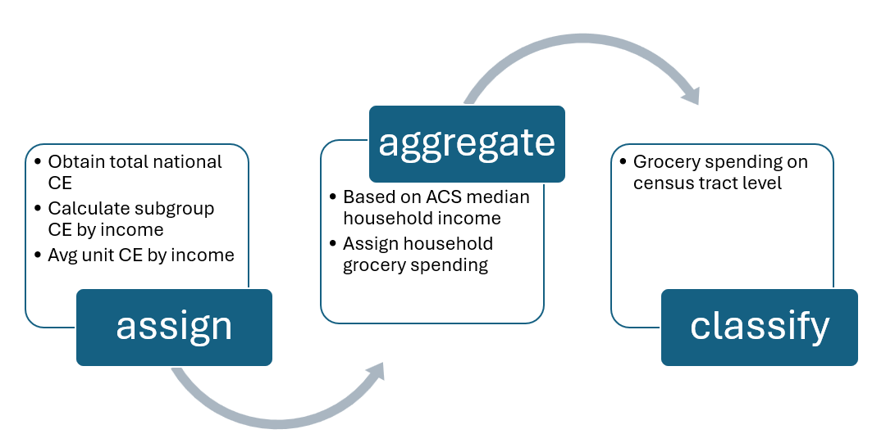

# Grocery Demand Estimation

## Project Overview

This project aims to answer the following key questions about grocery demand across Kootenai County:

- How much potential grocery demand exists across the county on census tract level?
- What are the spatial patterns of grocery demand?
- Which demographic characteristics are associated with areas of higher grocery demand?

By integrating Consumer Expenditure Survey (CE) data with American Community Survey (ACS) demographic data, this project estimates potential grocery expenditure at the census tract level and explores the demographic factors associated with spatial variations in grocery demand. 

---

## Objectives

- Estimate household grocery spending using BLS Consumer Expenditure Survey data.
- Classify census tracts into grocery demand categories.
- Map the spatial distribution of estimated grocery demand.
- Profile high- and low-demand areas using key demographic characteristics.

---

## Data Sources

- American Community Survey (ACS) 5-Year Estimates (U.S. Census Bureau)
- Consumer Expenditure Survey (CEX) (U.S. Bureau of Labor Statistics)
- Census Tract Boundaries and city shapefiles (U.S. Census Bureau)
 
---

# Methodology

## Step 1 — Household Grocery Spending Estimation

Household grocery expenditure estimates were calculated and obtained from the Bureau of Labor Statistics Consumer Expenditure Survey (CEX). Census tracts were matched to the appropriate expenditure category based on median household income, allowing each tract to receive an estimated annual grocery expenditure per household.

---

## Step 2 — Household-Level Grocery Spending

The map below shows the estimated annual grocery expenditure per household across Kootenai County. Household grocery spending generally increases with median household income and exhibits noticeable geographic variation across the county. 

Higher household grocery expenditures are concentrated in the northwestern part of the county around Spirit Lake. This area includes rural residential neighborhoods, lakefront properties, and larger homes, where some census tracts have relatively high median household incomes, resulting in higher estimated household grocery expenditures.

Another concentration occurs around Rockford Bay and the western shore of Lake Coeur d'Alene, where waterfront and higher-value residential properties are associated with relatively higher household incomes and, consequently, higher estimated grocery expenditures.

Across much of the southeastern portion of the county, several census tracts include established suburban and lakeside communities where median household incomes tend to exceed the county average. As a result, these areas also exhibit higher estimated household grocery expenditures.

---

## Step 3 — Census Tract Grocery Market Potential

Estimated household grocery expenditures were multiplied by the number of households within each census tract to calculate total annual grocery spending potential. The resulting map highlights the spatial distribution of estimated grocery demand across Kootenai County. Unlike the household-level expenditure map, which reflects estimated grocery spending per household, the tract-level demand map incorporates both the average household grocery expenditure and the number of households within each census tract.

As a result, the spatial pattern shifts from areas with higher household spending to areas with larger concentrations of households. High-demand census tracts are clustered along the urban corridor connecting Coeur d'Alene, Hayden, and Post Falls, particularly along the Interstate 90 corridor toward Spokane. Although some rural tracts have relatively high household grocery expenditures, their overall grocery demand remains lower because they contain fewer households. This demonstrates that population concentration is the primary driver of total grocery market potential at the census tract level.

---

## Step 4 — Demand Classification and Demographic Profiling

Census tracts were classified according to their estimated grocery market potential. Five core demographic variables were selected to characterize each demand category:

- Median household income
- Average household size
- Median age
- Bachelor's degree or higher (%)
- Homeownership rate

These variables provide a concise demographic profile of consumer demand while avoiding unnecessary complexity.

### Household-Level Grocery Demand Profile

The figures below summarize the demographic characteristics associated with estimated household grocery expenditure. Because household grocery expenditure is assigned based on median household income, it primarily reflects differences in income levels. The results also show that higher estimated household grocery expenditure is generally associated with older populations, higher educational attainment, and higher homeownership rates.

### Census Tract Grocery Demand Profile

The figures below summarize the demographic characteristics associated with total grocery market potential at the census tract level. In contrast to the household-level expenditure analysis, tract-level grocery demand exhibits negative correlations with median age, educational attainment, and homeownership rate. This pattern reflects the concentration of households in the county's urban areas, where population density is higher and residents tend to be relatively younger, have lower educational attainment, and lower homeownership rates than those in many rural census tracts. As a result, these urban tracts generate the highest overall grocery market potential despite not having the highest household grocery expenditure.

---

# Key Findings

- Grocery market potential is highly concentrated within the Coeur d'Alene–Post Falls urban corridor.
- Household count is the strongest contributor to total grocery spending potential.
- The methodology demonstrates how publicly available Census and Consumer Expenditure Survey data can be integrated to estimate retail market potential.

---

## Technologies Used

- Python
- Jupyter Notebook
- Pandas
- GeoPandas
- Matplotlib
- requests

---

## Future Improvements

- Apply the Huff Model to estimate grocery store market share.
- Integrate grocery store accessibility with market potential analysis.
- Identify underserved grocery markets with high demand but limited accessibility.
- Develop an interactive dashboard for exploring grocery market potential.

---

## Key Skills Demonstrated

- Consumer market analysis
- Census API data acquisition
- Consumer Expenditure Survey (CEX) integration
- Demographic analysis
- Geospatial data processing
- Spatial visualization
- Exploratory data analysis
- Correlation analysis
- Python-based GIS workflows

---

